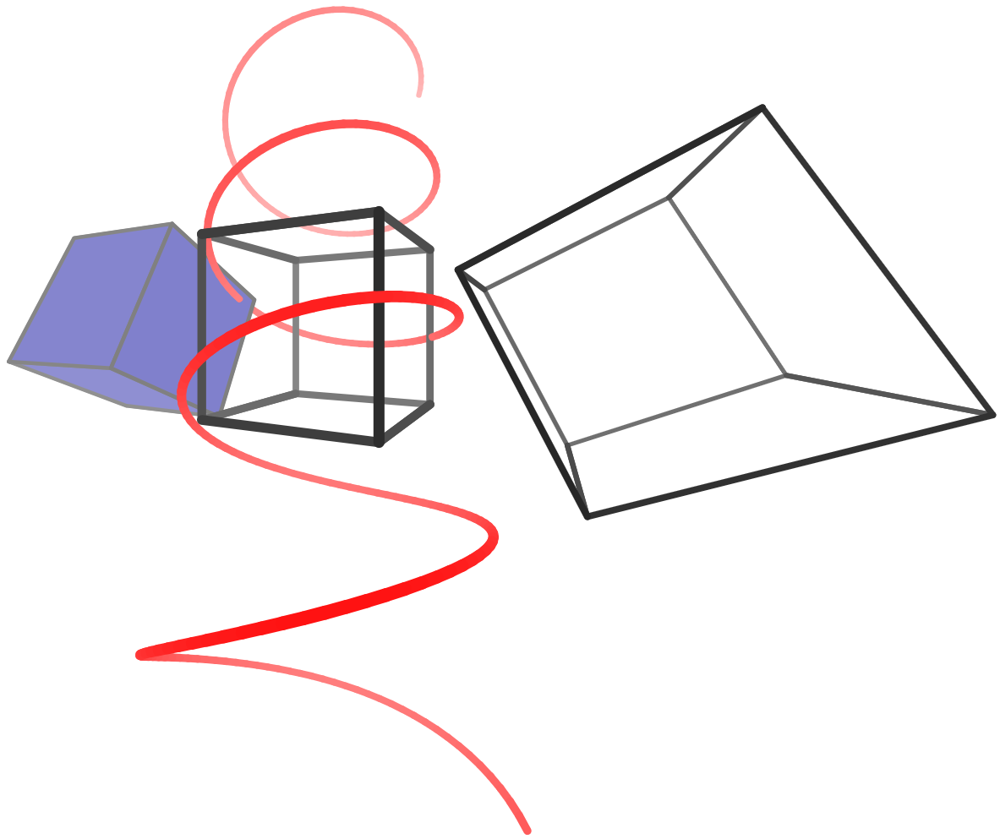

# SVG3D

## Overview

This repository contains code that adds 3D capabilities on top of
browser-based SVGs.  It builds on top of [SVG.js](svgjs.com).

See an example animation [here](nathancarter.github.io/svg3d), and its
source code [here](index.html).  That page shows things like this,
animated:

This is in a pre-alpha state.  It is a prototype/experiment only, and if it
were to move forward, it would need to be documented, tested, enhanced, plus
a build system introduced, etc.

## To-dos

Some enhancements I'd like to make include these.

 * Create a `Mesh` class that is a collection of `Polygon`s.
 * Extend the `Mesh` class with subdivision algorithms, including crease and
   sharpness parameters.  (This is especially important because right now
   the occlusion algorithm is only sometimes correct, due to SVG
   limitations.  One could make it better by taking large polygons and
   subdividing them into many little ones.)
 * Add classes for common shapes, such as:
    * Parametric surfaces
    * Spheres
    * Cylinders
    * Rectangular solids
